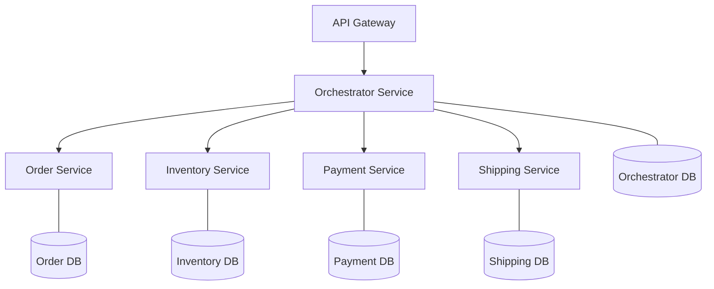

# 🚀 Saga Orchestration E-Commerce Microservices

Implementasi lengkap sistem E-Commerce menggunakan **Saga Orchestration Pattern** dengan fokus pada **Resilience** dan **Consistency**. Proyek ini menggunakan NestJS, PostgreSQL, dan Docker.

## 📊 Arsitektur Sistem

Sistem ini terdiri dari beberapa microservices yang saling berinteraksi melalui **Orchestrator Service**.



### Komponen Utama:
1.  **API Gateway (Port 3000)**: Entry point utama untuk client.
2.  **Orchestrator Service (Port 3001)**: Otak dari sistem yang mengatur alur transaksi Saga.
3.  **Order Service (Port 3002)**: Mengelola pembuatan dan pembatalan pesanan.
4.  **Inventory Service (Port 3003)**: Mengelola stok produk (Reserve/Release).
5.  **Payment Service (Port 3004)**: Mengelola pembayaran (Charge/Refund).
6.  **Shipping Service (Port 3005)**: Mengelola pembuatan pengiriman.

---

## 🔄 Saga Orchestration Pattern

Pola Saga digunakan untuk menjaga konsistensi data di berbagai layanan terdistribusi tanpa menggunakan transaksi terdistribusi yang berat (seperti 2PC).

### 1. Alur Transaksi (Happy Path)
Jika semua berjalan lancar, Orchestrator akan menjalankan langkah-langkah berikut:
- **CREATE_ORDER**: Membuat pesanan baru dengan status `PENDING`.
- **RESERVE_STOCK**: Mengunci stok produk di Inventory.
- **CHARGE_PAYMENT**: Melakukan penagihan pembayaran.
- **CREATE_SHIPMENT**: Membuat entri pengiriman produk.
- **COMPLETE**: Menandai transaksi Saga selesai.

### 2. Alur Kompensasi (Failure Path)
Jika salah satu langkah gagal (misal: saldo tidak cukup atau stok habis), Orchestrator akan menjalankan **Compensating Transactions** untuk membatalkan langkah sebelumnya:
- Jika **Payment** gagal: Orchestrator akan memanggil `RELEASE_STOCK` dan `CANCEL_ORDER`.
- Jika **Inventory** gagal: Orchestrator akan memanggil `CANCEL_ORDER`.

---

## 🛡️ Resilience Patterns

Sistem ini dilengkapi dengan pola ketahanan untuk menangani kegagalan jaringan atau layanan:

1.  **Circuit Breaker**: Mencegah sistem mencoba memanggil layanan yang sedang "sakit" atau down secara terus-menerus. Jika ambang kegagalan tercapai, sirkuit akan terbuka (`OPEN`) dan permintaan akan langsung ditolak atau dialihkan ke fallback.
2.  **Retry Logic (Exponential Backoff)**: Jika pemanggilan layanan gagal karena masalah sementara, Orchestrator akan mencoba kembali dengan jeda waktu yang meningkat secara eksponensial (misal: 1 detik, 2 detik, 4 detik).
3.  **State Persistence**: Status setiap transaksi Saga disimpan di database. Jika Orchestrator restart, ia dapat mengetahui status terakhir dari transaksi yang sedang berjalan.

---

## 🚀 Cara Menjalankan

### Prasyarat
- Docker & Docker Compose
- Node.js (jika ingin menjalankan secara lokal tanpa docker)

### Langkah-langkah
1.  **Clone Repositori**:
    ```bash
    git clone https://github.com/ufarqrobbany/saga-orchestration-ecommerce-microservices.git
    cd saga-orchestration-ecommerce-microservices
    ```

2.  **Jalankan dengan Docker Compose**:
    ```bash
    docker-compose up --build
    ```
    Ini akan menjalankan 6 layanan microservices dan 1 database PostgreSQL dengan database terpisah untuk setiap layanan.

3.  **Verifikasi Layanan**:
    - API Gateway: `http://localhost:3000`
    - Orchestrator: `http://localhost:3001`

---

## 🧪 Pengujian (Testing)

Gunakan `curl` atau Postman untuk melakukan pengujian. Pastikan menggunakan format **UUID** yang valid untuk `user_id` dan `product_id`.

### 1. Checkout Pesanan (Start Saga)
**Endpoint**: `POST http://localhost:3000/api/v1/orders/checkout`

**Payload JSON**:
```json
{
  "user_id": "550e8400-e29b-41d4-a716-446655440000",
  "total_amount": 150000,
  "items": [
    {
      "product_id": "7136f041-9457-45f8-8a8f-5c219662e6e3",
      "quantity": 2,
      "price": 75000
    }
  ]
}
```

**Contoh Command Curl**:
```bash
curl -X POST http://localhost:3000/api/v1/orders/checkout \
-H "Content-Type: application/json" \
-d '{
  "user_id": "550e8400-e29b-41d4-a716-446655440000",
  "total_amount": 150000,
  "items": [
    {
      "product_id": "7136f041-9457-45f8-8a8f-5c219662e6e3",
      "quantity": 2,
      "price": 75000
    }
  ]
}'
```

### 2. Cek Status Saga
Setelah melakukan checkout, Anda akan menerima `saga_id`. Gunakan ID tersebut untuk mengecek progress transaksi.

**Endpoint**: `GET http://localhost:3000/api/v1/orders/saga/{saga_id}`

**Contoh**:
```bash
curl http://localhost:3000/api/v1/orders/saga/YOUR_SAGA_ID_HERE
```

---

## 📁 Struktur Folder
- `api-gateway`: Entry point aplikasi.
- `orchestrator-service`: Logika Saga, Circuit Breaker, dan Retry.
- `order-service`: Domain Order.
- `inventory-service`: Domain Inventory.
- `payment-service`: Domain Payment.
- `shipping-service`: Domain Shipping.
- `shared-library`: Kode bersama (DTO, Types, Constants).
- `init.sql`: Inisialisasi database PostgreSQL.
